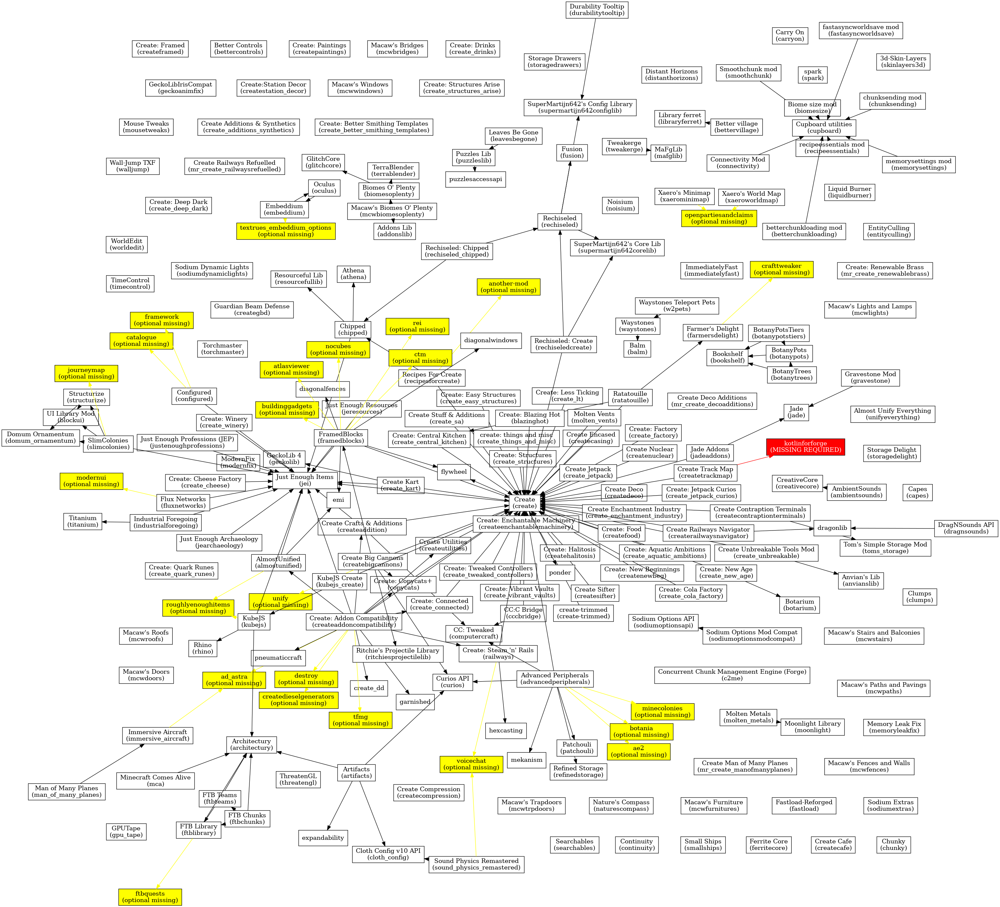

# ModpackGraphviz

This project generates a .dot file containing a GraphViz graph for the dependencies of all mods in a given folder.

It shows missing required mods in red, and missing optional mods in yellow.

The .dot file can be viewed with online viewers like [https://dreampuf.github.io/GraphvizOnline](https://dreampuf.github.io/GraphvizOnline) or by generating an image with graphviz installed:

```sh
# force directed graph layouts
neato -Tpng graph.dot -o graph.png
fdp -Tpng graph.dot -o graph.png
sfdp -Tpng graph.dot -o graph.png
```

Example image (generated with `fdp`):

